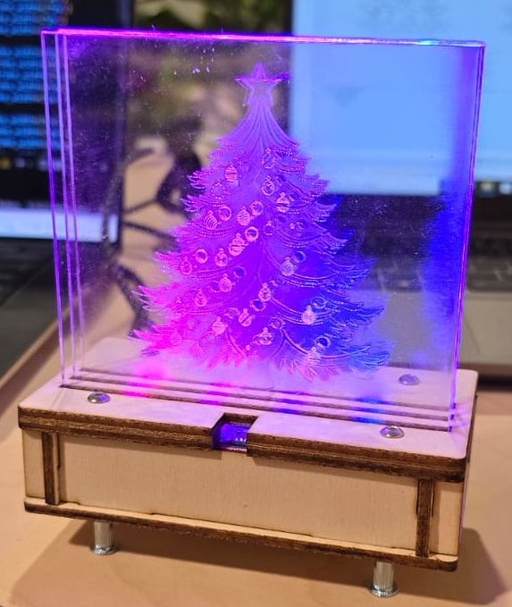

# 2024 Christmas project

A colaboration between:
- The Sensmakers Amsterdam IoT community: www.sensemakersams.org
- The Amsterdam Public Library: www.oba.nl
- in2tech: www.in2tech.nl
- Matanga: www.matanga.nl

Subdirectories:
- *src* for the python source files,
- *elec* for the schematics and PCB design in KiCad, PDF and JLCPCB manifacture formats,
- *case* for the design of the case and acrylic parts of the case.

For more info consult [https://sensemakersams.org/xmas-2024-acrylic-lamp/](https://sensemakersams.org/xmas-2024-acrylic-lamp/)

